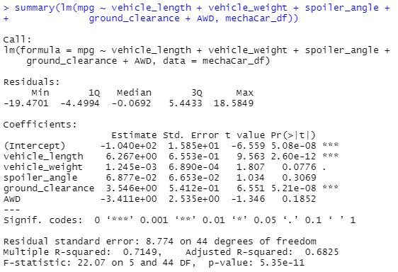
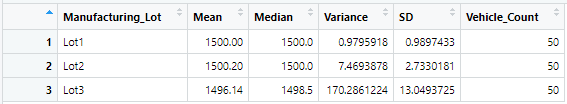
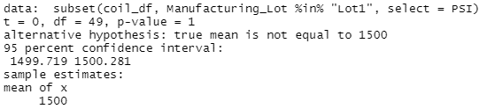
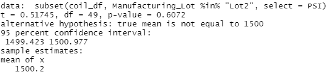
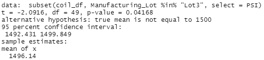

# MechaCar_Statistical_Analysis

## Linear Regression to Predict MPG

1. **Which variables/coefficients provided a non-random amount of variance to the mpg values in the data set?**  
The variables with the greatest impact on variance in this analysis are ground clearance, vehicle length, and the intercept. 

2. **Is the slope of the linear model considered to be near zero? Why or why not?**  
Without an actual visualization or a slope analysis on this multi-variable regression, 
it's impossible to say for certain that this linear regression would have a non-zero 
slope. However, it can be assumed (based on the strong correlation between variables and their impact on variance)
that the slope of the regression would not be considered near zero.  

3. **Does this linear model predict MPG of MechaCar prototypes effectively? Why or why not?**  
Based on summary statistics (α=0.05, p=5.35e-11), it can be assumed that this model effectively predicts Mecha MPG. 
Still, further investigation should be done on a larger sample size to ensure that this model is scalable and replicable at a larger degree.

## Summary Statistics on Suspension Coils
1. **The design specifications for the MechaCar suspension coils dictate that the variance of the suspension coils 
must not exceed 100 pounds per square inch. Does the current manufacturing data meet this design specification 
for all manufacturing lots in total and each lot individually? Why or why not?**  
While the overall summary falls within this range (variance = 62.30 PSI), the individual lots do not all comply. 
Lot 1 (v = 0.98 PSI) and lot 2 (v = 7.47 PSI) are both < 100 PSI, however lot 3 (v = 170.29 PSI) is approximately 1.7x the design specification. 
Because of the extreme difference between Lot1/2 and Lot3, the total summary should not be considered an accurate value. 
Lot 3 should be retested for verification purposes, and if necessary, adjustments should be made. 
#### Total Summary

#### Lot Summary

## T-Tests on Suspension Coils
T-test analysis on the three lots showed the following: 
- Lot 1's mean is similar to the total mean. (p = 1) 
- Lot 2's mean is similar to the total mean. (p = 0.61)
- Lot 3's mean is different from the total mean to a statistically significant degree. (p = 0.04)  
This analysis further confirms the variance findings regarding lot PSI. 

#### Lot 1

#### Lot 2

#### Lot 3

## Study Design: MechaCar vs Competition

**Metrics to be tested:**  
Reliability over time  

**Question:**   
Can we determine the reliability of a vehicle based on how many cars remain in use/on the road ten years after initial purchase, 
based on the number of vehicles actively registered, and is there a difference between MechaCar's reliability rate as compared 
to their competitors?   

**Alternative/Null Hypotheses**  
**Hα:** There is a statistically significant different in the number of MechaCars on the road ten years after purchase as compared to 
competitors.   
**H0:** There is no difference between the number of MechaCars remaining and Competitor cars remaining after ten years.   

**Statistical Test:**  
Multi-sample t-testing, measuring the timelines of various manufacturer's car. This data will be sorted in an ordinal manner to 
determine which manufacturer produces the most long-term reliable vehicles.   

**Data for Testing**  
Access to active car registration data OR a survey with a large sample size measuring the length of time vehicles remain in use after purchase. 
Either data set should include the make/model of the vehicle, the initial year it was purchased, whether it is currently on the road, and (if possible) whether the owner intends to replace it within the following year. 
